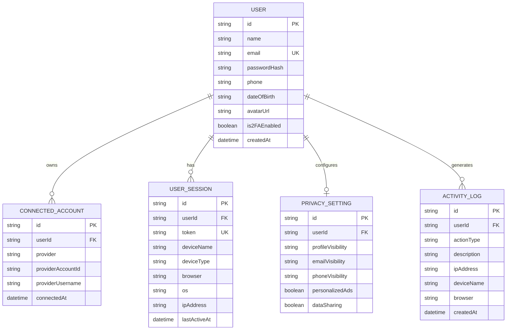

# ♾️ Meta Accounts Center - Full Stack Developer Assignment

**Company**: Red Software  
**Assignment**: Design & Develop Meta Accounts Center  
**Tech Stack**: Next.js 14 (App Router), TypeScript, Prisma ORM (SQLite / PostgreSQL / MySQL compatible), Tailwind CSS, JWT Authentication, OpenAPI / Swagger UI.

---

## 🌟 Features Implemented

### 1. 🔐 Secure Authentication & Session Management
- User Registration & Login with bcrypt password hashing.
- JWT Cookie & Authorization Bearer header authentication.
- **Forgot Password** mock reset flow.
- Automated IP address, browser, OS, and device type detection on login.

### 2. 📊 Accounts Center Dashboard
- Centralized overview of user profile details, connected accounts, security status, and active devices.

### 3. 👤 Profile Management
- Update Full Name, Email, Phone Number, Date of Birth, and Profile Picture Avatar URL.

### 4. 🔗 Connected Social Accounts
- Link and manage connected accounts (**Instagram**, **Facebook**, **WhatsApp**).
- Interactive Mock OAuth modal flow for connecting new platforms.
- Disconnect / remove social accounts.

### 5. 🛡️ Security Center
- Change account password with old password verification.
- **Two-Factor Authentication (2FA)** enable/disable toggle.
- Remote device logout capability.

### 6. 🔒 Privacy Settings
- Configure **Profile Visibility** (Everyone, Friends, Only Me).
- Configure **Email & Phone Visibility**.
- Toggle **Personalized Ads** and **Third-Party Data Sharing** preferences.

### 7. 📜 Activity Logs History
- Audit trail for security actions: Logins, Password changes, Profile updates, Connected account changes, Privacy updates, and Session revokes.
- Stores Date & Time, Action Type, Device Name, Browser, and IP address.
- Interactive filtering by action type.

### 8. 📱 Connected Device Management
- View active device sessions.
- Revoke individual session or **Logout from all other devices**.

---

## 🎁 Bonus Features Included

- 🌓 **Dark Mode / Light Mode** persistent toggle matching Meta design.
- 📄 **Interactive Swagger / OpenAPI 3.0 Documentation** live at `/api-docs`.
- 🐳 **Docker & Docker-Compose** ready.
- 🧪 **Prisma Database Seed Data** for immediate demo testing.

---

## 🚀 Quick Start Guide

### Prerequisites
- Node.js v18+ or v20+
- npm or yarn

### 1. Clone & Install Dependencies
```bash
cd RedSoftsolutionProject
npm install
```

### 2. Setup Environment & Database
Create `.env` file (or copy `.env.example`):
```env
DATABASE_URL="file:./dev.db"
JWT_SECRET="meta_accounts_center_super_secret_jwt_key_2026_redsoftware"
PORT=3000
```

Run database migration & seeding:
```bash
npx prisma db push
npm run prisma:seed
```

### 3. Run Development Server
```bash
npm run dev
```
Open [http://localhost:3000](http://localhost:3000) in your browser.

---

## 🔑 Demo Credentials

For instant testing out of the box, use the pre-seeded account:

- **Email**: `demo@redsoftware.in`
- **Password**: `Password123!`

---

## 🗺️ Database Schema (ER Diagram Representation)



---

## 📡 REST API Documentation

| Endpoint | Method | Description |
| :--- | :--- | :--- |
| `/api/auth/register` | `POST` | Register a new user |
| `/api/auth/login` | `POST` | Authenticate user & start session |
| `/api/auth/logout` | `POST` | Log out current session |
| `/api/auth/forgot-password` | `POST` | Request password reset link |
| `/api/auth/me` | `GET` | Get authenticated user info |
| `/api/profile` | `GET` / `PUT` | View or update profile details |
| `/api/connected-accounts` | `GET` / `POST` / `DELETE` | Manage connected social accounts |
| `/api/security/change-password` | `PUT` | Update account password |
| `/api/security/2fa` | `POST` | Toggle 2FA status |
| `/api/privacy` | `GET` / `PUT` | View or update privacy settings |
| `/api/activity` | `GET` | Fetch activity log history |
| `/api/devices` | `GET` / `DELETE` | Manage active sessions and devices |
| `/api/docs` | `GET` | OpenAPI 3.0 specification JSON |

View full interactive Swagger UI at **`/api-docs`**.

---

## 🐳 Docker Support

Run with Docker Compose:
```bash
docker-compose up --build
```
The application will be accessible at `http://localhost:3000`.

---

## 📄 Submission Contact

- **To**: `sanket.debnath@redsoftware.in`
- **CC**: `hr.redsoftware.in`
